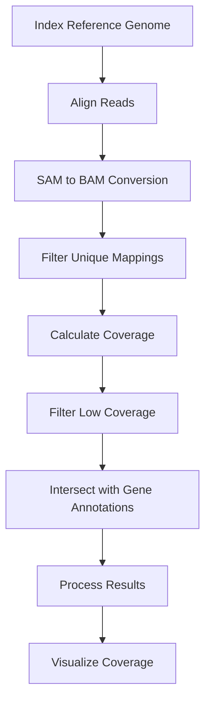

# Brassica Carinata Copy Number Variation Analysis Pipeline

This pipeline processes whole genome sequencing data for Brassica carinata, from raw reads to coverage analysis. The workflow includes read alignment, BAM processing, coverage calculation, and visualization.

## Pipeline Overview



## 1. Reference Genome Indexing

```bash
# Index the reference genome using BWA
bwa index GCA_040584065.1_ASM4058406v1_genomic.fna
```

## 2. Read Alignment

```bash
#!/bin/bash
# Align trimmed reads to reference genome

# Configuration - update these paths for your environment
DIR="data/trimmed_reads"
REF="data/reference/GCA_040584065.1_genomic.fna"
OUTPUT_DIR="results/alignments"
THREADS=8

mkdir -p ${OUTPUT_DIR}

for file in ${DIR}/*_1_trimmed.fq.gz; do
  base=$(basename "${file}" _1_trimmed.fq.gz)
  pair="${DIR}/${base}_2_trimmed.fq.gz"

  if [ -f "${pair}" ]; then
    echo "Aligning ${base}..."
    bwa mem -t ${THREADS} ${REF} ${file} ${pair} > ${OUTPUT_DIR}/${base}.sam 2> ${OUTPUT_DIR}/${base}.err
    if [ $? -ne 0 ]; then
      echo "Error aligning ${base}"
    fi
  else
    echo "Missing pair for ${base}"
  fi
done
```

## 3. SAM to BAM Conversion

```bash
#!/bin/bash
# Convert SAM to sorted BAM format

DIR="results/alignments"
OUTPUT_DIR="results/bam_files"
THREADS=8

mkdir -p "$OUTPUT_DIR"

for SAM_FILE in "$DIR"/*.sam; do
  BASENAME=$(basename "$SAM_FILE" .sam)
  BAM_FILE="$OUTPUT_DIR/${BASENAME}.bam"
  SORTED_BAM_FILE="$OUTPUT_DIR/${BASENAME}_sorted.bam"
  
  echo "Processing $BASENAME..."
  
  samtools view -@ "$THREADS" -Sb "$SAM_FILE" > "$BAM_FILE"
  samtools sort -@ "$THREADS" -o "$SORTED_BAM_FILE" "$BAM_FILE"
  samtools index -@ "$THREADS" "$SORTED_BAM_FILE"
  rm "$BAM_FILE"
done
```

## 4. Filter Unique Mappings

```bash
#!/bin/bash
# Filter for uniquely mapped reads

INPUT_DIR="results/bam_files"
FILTERED_OUTPUT_DIR="results/unique_mappings"
THREADS=8

mkdir -p "$FILTERED_OUTPUT_DIR"

for BAM_FILE in "$INPUT_DIR"/*.bam; do
  BASENAME=$(basename "$BAM_FILE" .bam)
  FILTERED_BAM_FILE="$FILTERED_OUTPUT_DIR/${BASENAME}_filtered.bam"
  
  echo "Filtering $BASENAME..."
  samtools view -h "$BAM_FILE" | awk '$0 ~ /^@/ || ($0 !~ /XA:Z:/ && $0 !~ /SA:Z:/)' | samtools view -b - > "$FILTERED_BAM_FILE"
  samtools index -@ "$THREADS" "$FILTERED_BAM_FILE"
done
```

## 5. Coverage Analysis

### 5.1 Calculate Depth

```bash
#!/bin/bash
# Calculate coverage depth

FILTERED_INPUT_DIR="results/unique_mappings"
DEPTH_OUTPUT_DIR="results/depth"
THREADS=8

mkdir -p "$DEPTH_OUTPUT_DIR"

for FILTERED_BAM_FILE in "$FILTERED_INPUT_DIR"/*_filtered.bam; do
  BASENAME=$(basename "$FILTERED_BAM_FILE" _filtered.bam)
  DEPTH_FILE="$DEPTH_OUTPUT_DIR/${BASENAME}_depth.txt"
  
  echo "Calculating depth for $BASENAME..."
  samtools depth -a -@ "$THREADS" "$FILTERED_BAM_FILE" > "$DEPTH_FILE"
done
```

### 5.2 Filter Low Coverage

```bash
#!/bin/bash
# Filter positions with coverage < 2

DEPTH_INPUT_DIR="results/depth"
FILTERED_DEPTH_OUTPUT_DIR="results/filtered_depth"

mkdir -p "$FILTERED_DEPTH_OUTPUT_DIR"

for DEPTH_FILE in "$DEPTH_INPUT_DIR"/*_depth.txt; do
  BASENAME=$(basename "$DEPTH_FILE" _depth.txt)
  FILTERED_DEPTH_FILE="$FILTERED_DEPTH_OUTPUT_DIR/${BASENAME}_filtered_depth.txt"
  
  echo "Filtering $BASENAME..."
  awk -F '\t' '$3>=2' "$DEPTH_FILE" > "$FILTERED_DEPTH_FILE"
done
```

## 6. Gene Annotation Intersection

```bash
#!/bin/bash
# Intersect coverage data with gene annotations

TRANSFORMED_INPUT_DIR="results/filtered_depth"
INTERSECT_OUTPUT_DIR="results/gene_intersections"
GFF_FILE="data/annotations/gene_filtered_modified.txt"

mkdir -p "$INTERSECT_OUTPUT_DIR"

for TRANSFORMED_FILE in "$TRANSFORMED_INPUT_DIR"/*_filtered_depth.txt; do
  BASENAME=$(basename "$TRANSFORMED_FILE" _filtered_depth.txt)
  INTERSECT_OUTPUT_FILE="$INTERSECT_OUTPUT_DIR/${BASENAME}_intersect.txt"
  
  echo "Intersecting $BASENAME with gene annotations..."
  bedtools intersect -a "$GFF_FILE" -b "$TRANSFORMED_FILE" -wa -wb > "$INTERSECT_OUTPUT_FILE"
done
```

## 7. Data Processing

### 7.1 Extract Relevant Columns

```bash
#!/bin/bash
# Process intersection results

INTERSECT_INPUT_DIR="results/gene_intersections"
PROCESSED_OUTPUT_DIR="results/processed"

mkdir -p "$PROCESSED_OUTPUT_DIR"

for INTERSECT_FILE in "$INTERSECT_INPUT_DIR"/*_intersect.txt; do
  BASENAME=$(basename "$INTERSECT_FILE" _intersect.txt)
  PROCESSED_OUTPUT_FILE="$PROCESSED_OUTPUT_DIR/${BASENAME}_processed.txt"
  
  echo "Processing $BASENAME..."
  awk -F'\t' '{print $1 "\t" $4 "\t" $5 "\t" $10 "\t" $11 "\t" $12 "\t" $13}' "$INTERSECT_FILE" > "$PROCESSED_OUTPUT_FILE"
done
```

### 7.2 Calculate Gene Coverage Medians (R Script)

```r
# Calculate median coverage per gene
setwd("results/processed")
files <- list.files(pattern = "_processed.txt$")
output_dir <- "results/aggregated"

if (!dir.exists(output_dir)) dir.create(output_dir)

for (file in files) {
  genetxt <- read.table(file, header = FALSE, sep = "\t")
  colnames(genetxt) <- paste0("column", 1:ncol(genetxt))
  median_bna <- aggregate(column7 ~ column1 + column2 + column3, data = genetxt, median)
  
  output_file <- paste0(output_dir, "/mod_median_", gsub("_processed.txt$", "", file), ".txt")
  write.table(median_bna, file = output_file, sep = "\t", row.names = FALSE, col.names = FALSE)
}
```

### 7.3 File Renaming (Python)

```python
import os

# Clean up filenames
folder_path = 'results/aggregated'

for filename in os.listdir(folder_path):
    if filename.startswith("mod_median_") and filename.endswith(".txt"):
        new_name = filename.replace("mod_median_", "").replace("_sorted", "")
        os.rename(os.path.join(folder_path, filename), 
                 os.path.join(folder_path, new_name))
```

## 8. Visualization

### 8.1 Coverage Plotting (R Script)

```r
library(ggplot2)
library(dplyr)

file_directory <- "results/aggregated"
file_list <- list.files(file_directory, pattern = "\\.txt$", full.names = TRUE)

generate_plots <- function(file_path) {
  file_name <- tools::file_path_sans_ext(basename(file_path))
  data <- read.table(file_path, header = FALSE, sep = "\t")
  
  # Data processing and plotting code here
  # (See original script for full implementation)
  
  ggsave(paste0(file_name, "_coverage_plot.png"), 
         width = 25, height = 3, dpi = 150)
}

lapply(file_list, generate_plots)
```

## Directory Structure

```
project/
├── data/
│   ├── trimmed_reads/       # Trimmed FASTQ files
│   ├── reference/           # Reference genome
│   └── annotations/         # Gene annotations
└── results/
    ├── alignments/          # SAM files
    ├── bam_files/           # BAM files
    ├── unique_mappings/     # Filtered BAMs
    ├── depth/               # Coverage files  
    ├── filtered_depth/      # Filtered coverage
    ├── gene_intersections/  # Gene overlaps
    ├── processed/           # Processed data
    ├── aggregated/          # Final results
    └── plots/               # Output plots
```

## Dependencies

- BWA (v0.7.17)
- SAMtools (v1.12)
- BEDtools (v2.30.0)
- R (v4.1.0) with packages:
  - ggplot2
  - dplyr
  - tidyverse
- Python (v3.8)

## Usage

1. Update paths in configuration sections
2. Run scripts in order:
   ```bash
   bash 1_index_reference.sh
   bash 2_align_reads.sh
   bash 3_convert_to_bam.sh
   # ... and so on
   ```

## License

MIT License - Free for academic use
